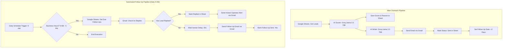

# Autonomous Sales Machine

An end-to-end autonomous B2B sales outreach and follow-up engine built in **n8n**. It automates cold email lead qualification using **Groq + Llama 3.3 70B**, schedules and delivers personalized outreach via **Gmail**, monitors inbox replies, handles 2-day follow-ups during business hours, and provides live pipeline metrics through a dedicated **Client Portal** and **Executive Dashboard**.

---

## Visuals & Architecture

### Workflow Canvas

### Executive Dashboard

### Client Portal

---

## Interactive Dashboards & Portals

This automation includes production-ready, standalone web interfaces for monitoring lead status, tracking reply rates, and offering client-facing transparency:

- **Executive Analytics Dashboard**: [Open Local File](./Dashboard.html) · 🌐 **[Live Hosted Dashboard](https://ehtishamazing.github.io/sales-dashboard/index.html)**
  - Real-time pipeline KPI cards (Total Leads, Emails Sent, Automated Follow-Ups, Leads Replied, Average Lead Score).
  - Dynamic Chart.js visualizations for pipeline status distribution, lead score breakdown, and response rates.
  - Live data grid showing individual lead records with status badges.
- **Multi-Tenant Client Portal**: [Open Local File](./Client%20Portal.html)
  - Client authentication interface with secure Client ID & Access Key gating.
  - Dedicated client view displaying outbound campaign metrics, scheduled touchpoints, and conversion status.

---

## How It Works

The system operates across two interconnected workflow pipelines: the **Main Outreach Sequence** (manual or batch triggered) and the **Automated Follow-Up Sequence** (daily scheduled cron).

### Step-by-Step Execution Breakdown

#### 1. Lead Ingestion & Qualification
- **Fetch Unprocessed Leads**: The `Get Leads` node queries Google Sheets for rows where the `Status` is empty/pending.
- **AI Scoring Engine**: The `Scorer` LangChain LLM Chain node sends lead attributes (`Name`, `Business`, `Email`, `row_number`) to **Groq (`llama-3.3-70b-versatile`)**. It assesses the business profile on a 1–10 scale and provides structured JSON with a numerical score and rationale.
- **Database Synchronization**: The `Save Score` node writes the calculated score and explanation back to Google Sheets against the matching `row_number`.

#### 2. Dynamic Copywriting & Cold Email Delivery
- **Contextual Copy Generation**: The `AI Writer` node crafts a natural, 3-paragraph cold email customized to the recipient's specific business niche without robotic jargon.
- **Email Delivery**: The `Send Email` node dispatches a responsive HTML email through the connected Gmail account with the subject line `Quick idea for <Business>`.
- **Status & Follow-up Timers**: The `Mark Sent` node updates the lead row status to `Sent`, and `Set Follow Up Date` calculates `$now.plus(2, 'days').toISO()` and writes the scheduled follow-up timestamp to Google Sheets.

#### 3. Automated Follow-Up & Reply Detection Pipeline
- **Daily Cron Trigger**: Executes every morning at **9:00 AM** via `Schedule Trigger`.
- **Business Hours Enforcement**: An `If` condition node (`Business Hours?`) evaluates `new Date().getHours()` ensuring emails only fire between 9:00 AM and 5:00 PM.
- **Due Follow-Up Ingestion**: `Get Due Follow Ups` retrieves all leads with outreach already sent where follow-up remains pending.
- **Inbox Search & Reply Verification**: The `Check for Replies` Gmail node searches for inbound emails matching the lead's address.
- **Branching Logic**:
  - **Lead Replied**: Updates Google Sheets to `Replied: Yes` and triggers `Reply Alert` (an instant Gmail notification to the sales operator with lead details and score).
  - **No Reply Detected**: Executes a 30-second humanized pause (`Human Delay`), dispatches a polite follow-up email via Gmail (`Send Follow Up`), and updates the sheet via `Mark Follow Up Sent`.

---

## Tech Stack & Node Architecture

| Component / Service | Technology | Purpose |
| :--- | :--- | :--- |
| **Orchestration** | [n8n](https://n8n.io/) (Workflow Automation) | Workflow engine, branching logic, schedule triggers |
| **AI LLM Engine** | **Groq** (`llama-3.3-70b-versatile`) | Fast inference for lead scoring & cold email copywriting |
| **LangChain Nodes** | `@n8n/n8n-nodes-langchain.chainLlm`, `lmChatGroq` | Structured prompt execution and model connectivity |
| **Email Delivery & Alerts**| **Gmail OAuth2 API** (`n8n-nodes-base.gmail`) | Outbound outreach, follow-up delivery, inbox reply checks, operator alerts |
| **Database / CRM** | **Google Sheets OAuth2** (`n8n-nodes-base.googleSheets`) | Master CRM for leads, scores, timestamps, and pipeline status |
| **Execution Control** | `scheduleTrigger`, `if`, `wait`, `manualTrigger` | 9 AM cron, business hours validation, humanized delays |
| **User Interfaces** | HTML5, Vanilla JavaScript, Chart.js, Google Sheets API GViz | Live KPI metrics dashboard and multi-tenant client portal |

---

## Key Features

- **Autonomous Lead Scoring (1–10)**: AI analyzes business viability and provides rationales directly in your CRM.
- **Personalized 3-Paragraph Cold Outreach**: Contextual emails written dynamically for each lead.
- **Two-Day Follow-Up Automation**: Calculates exact follow-up dates and schedules automated touchpoints.
- **Inbox Reply Intelligence**: Checks Gmail threads for inbound responses to avoid emailing engaged prospects.
- **Operator Instant Alerts**: Notifies sales reps immediately upon receiving a lead response.
- **Business Hours Guardrail**: Restricts email dispatch to 9:00 AM – 5:00 PM local time.
- **Humanized Delivery Delays**: Introduces natural pauses between follow-ups to maintain deliverability.
- **Dual Visual Frontends**: Includes an executive analytics dashboard and a client-facing portal.

---

## Setup & Configuration

### Prerequisites
1. An active [n8n](https://n8n.io/) instance (Self-hosted or n8n Cloud).
2. A [Groq API Key](https://console.groq.com/).
3. A Google Cloud Console project with **Google Sheets API** and **Gmail API** enabled (or standard n8n Google OAuth2 credentials).

### Import Steps
1. In your n8n workspace, navigate to **Workflows** → **Import from File**.
2. Select [`Autonomous Sales Machine.json`](./Autonomous%20Sales%20Machine.json).
3. Connect your credentials in n8n:
   - **Groq API**: Add your Groq API key under credentials.
   - **Google Sheets OAuth2**: Authenticate your Google account with access to your CRM spreadsheet.
   - **Gmail OAuth2**: Authenticate the sender Gmail account.
4. Update the Google Spreadsheet ID in the `Get Leads`, `Save Score`, `Mark Sent`, `Set Follow Up Date`, `Get Due Follow Ups`, `Mark Follow Up Sent`, and `Replied` nodes.
5. In the `Reply Alert` node, set the notification recipient email to your operator address.
6. Activate the workflow.

---

## Demo

- **LinkedIn Demo**: `TO_BE_ADDED`
