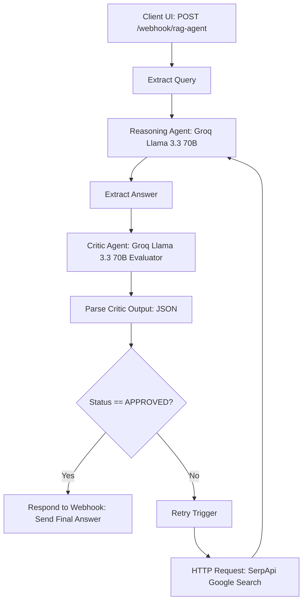

# Groqtalk AI — Multi-Agent Reasoning & Critic Engine

A low-latency, multi-agent AI system built on **n8n** and powered by **Groq (`llama-3.3-70b-versatile`)**. It implements a dual-agent **Reasoning & Critic** feedback loop with live web search grounding via **SerpApi**, served through a chat application frontend (**GROQTALK PRO**).

---

## Visuals & User Interface

### Workflow Canvas


### Chat Dashboard


### Welcome Interface


---

## Interactive Interface

This project includes a self-contained chat interface with conversation history, Markdown formatting support, and real-time response streaming:

- **GROQTALK PRO Chat Application**: [Open Groqtalk UI](./GROQTALK%20PRO.html)
  - Dark-mode interface styled with TailwindCSS and FontAwesome icons.
  - Multi-session local conversation history management in `localStorage`.
  - Direct webhook connectivity targeting `http://localhost:5678/webhook/rag-agent`.

---

## How It Works

Groqtalk AI employs an iterative multi-agent architecture where a primary **Reasoning Agent** generates an answer, and a strict **Critic Agent** evaluates accuracy and completeness before returning the response to the user.



### Step-by-Step Execution Breakdown

#### 1. Ingestion & Preprocessing
- **Webhook Listener**: The `Webhook` node listens for inbound `POST` requests at `/webhook/rag-agent`.
- **Query Extraction**: The `Extract Query` JavaScript function extracts and normalizes `$json.body.query`.

#### 2. First-Pass Reasoning
- **Reasoning Agent**: Dispatches the prompt to the Groq API endpoint (`https://api.groq.com/openai/v1/chat/completions`) using the `llama-3.3-70b-versatile` model.
- **Answer Parsing**: The `Extract Answer` node isolates the content from `$json.choices[0].message.content`.

#### 3. AI Critic Evaluation & Grounding Loop
- **Critic Agent**: Evaluates the candidate answer with a strict system prompt (`"You are a strict AI critic. Always return valid JSON only."`) and scores factual consistency.
- **Parse Critic**: Evaluates the critic's JSON response to determine verification status (`APPROVED` or revision needed).
- **Conditional Branching (`Approved?`)**:
  - **APPROVED**: Routes directly to `Respond` to return the verified markdown text to the client.
  - **REJECTED / UNVERIFIED**: Triggers the `Retry` loop, which executes a live web query via `HTTP Request` to **SerpApi** (`https://serpapi.com/search.json`), feeding real-time search context back into the Reasoning Agent for grounded revision.

---

## Tech Stack & Node Architecture

| Component / Service | Technology | Purpose |
| :--- | :--- | :--- |
| **Workflow Engine** | [n8n](https://n8n.io/) | Webhook handling, loop routing, agent pipeline orchestration |
| **LLM Inference** | **Groq LPU Engine** (`llama-3.3-70b-versatile`) | Ultra-fast token generation for reasoning and evaluation |
| **Search API** | **SerpApi** (Google Search Engine) | Real-time web retrieval for fact grounding and fallback retrieval |
| **Core n8n Nodes** | `webhook`, `httpRequest`, `function`, `if`, `respondToWebhook` | Webhook endpoints, API calls, state evaluation |
| **Frontend UI** | HTML5, TailwindCSS, Vanilla JavaScript, FontAwesome | Chat UI with sidebar history and message rendering |

---

## Key Features

- **Multi-Agent Self-Correction**: Implements an automated primary reasoning agent + independent critic agent loop.
- **Sub-Second LPU Inference**: Powered by Groq's LPU hardware architecture for rapid response times.
- **Dynamic Web Grounding**: Leverages SerpApi for real-time web search fallback when initial answers require supplemental data.
- **JSON-Structured Evaluation**: Critic outputs strict status schemas to control execution branches.
- **Production Chat Interface**: Includes a responsive web application (`GROQTALK PRO.html`) with conversation history and clean styling.

---

## Setup & Configuration

### Prerequisites
1. An active [n8n](https://n8n.io/) instance.
2. A [Groq API Key](https://console.groq.com/).
3. A [SerpApi Key](https://serpapi.com/) for live search capabilities.

### Import Steps
1. In n8n, go to **Workflows** → **Import from File**.
2. Select [`Groq Multi-Agent Lite.json`](./Groq%20Multi-Agent%20Lite.json).
3. Configure API Credentials:
   - In the **Reasoning Agent** and **Critic Agent** HTTP Request nodes, update the `Authorization` header with your Groq API key:
     ```
     Bearer YOUR_GROQ_API_KEY
     ```
   - In the **HTTP Request (SerpApi)** node, update the URL parameter with your SerpApi key:
     ```
     api_key=YOUR_SERPAPI_KEY
     ```
4. Activate the workflow and test the webhook endpoint via [`GROQTALK PRO.html`](./GROQTALK%20PRO.html).

---

## Demo

- **LinkedIn Demo**: `TO_BE_ADDED`
