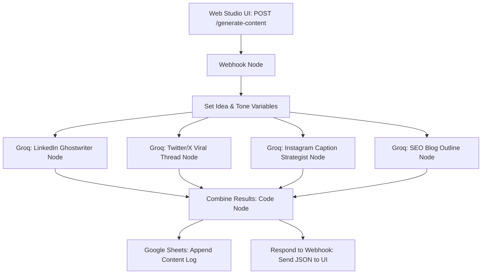

# SmartPost AI — Multi-Platform Content Generation Studio

An automated AI content syndication pipeline built on **n8n** and powered by **Groq (`llama-3.3-70b-versatile`)**. It converts a single seed idea into four platform-tailored content formats—**LinkedIn Post**, **Twitter/X Thread**, **Instagram Caption**, and **SEO Blog Outline**—and automatically logs the generated assets to a **Google Sheets CRM**.

---

## Visuals & Studio Dashboard

### Workflow Canvas


### Studio Dashboard


---

## Interactive Studio Interface

This project includes a content generation studio interface with live tab switching, local bookmarks, generation history, and real-time webhook connectivity:

- **SmartPost AI Studio**: [Open SmartPost AI UI](./SmartPost%20AI.html)
  - Glassmorphic interface with custom brand voice selector (*Professional & Bold*, *Witty / Viral*, *Educational & Detailed*, *Motivational & Gritty*, *Sarcastic & Funny*, *Minimalist & Clean*).
  - Four dedicated output cards with copy-to-clipboard and bookmarking support.
  - Generation history stored in browser `localStorage`.
  - Connects to the local webhook endpoint at `http://localhost:5678/webhook-test/generate-content` (or production URL).

---

## How It Works

SmartPost AI executes parallel AI generation across multiple platform-specialized prompts simultaneously, aggregates the output via custom JavaScript, stores the record in a spreadsheet CRM, and returns a unified JSON payload to the user interface.



### Step-by-Step Execution Breakdown

#### 1. Ingestion & Parameter Extraction
- **Webhook Endpoint**: The `Webhook` node receives a JSON payload containing `idea` and `tone`.
- **Set Idea**: The `Set` node normalizes and stores the input variables for downstream parallel consumption.

#### 2. Parallel Multi-Model Generation (Groq LPU)
- **LinkedIn Post**: Generates founder-style thought leadership with a strong opening hook, clean line spacing, and a discussion question.
- **Twitter Thread**: Constructs a 5-part threaded breakdown numbered `1/`, `2/`, ..., `5/` with a punchy hook, key insights, and a conclusive takeaway.
- **Instagram Caption**: Writes an engaging 2-paragraph value post with contextual formatting, natural call-to-action, and relevant hashtags.
- **Blog Outline**: Produces an SEO-optimized blog structure including an H1 title, meta description, and organized H2/H3 section headers.

#### 3. Data Aggregation & Persistence
- **Combine Results (Code Node)**: A JavaScript script scans previous node responses, extracts each platform's generated copy, and constructs a structured payload with a timestamp.
- **Google Sheets CRM Sync**: The `Save to Sheets` node appends a new record to the `Content Log` sheet with columns: `Main Idea`, `Brand Voice`, `LinkedIn Post`, `Twitter Content`, `Instagram Caption`, `Blog Outline`, and `Generated At`.
- **Synchronous Response**: The `Respond` node returns the compiled JSON back to the frontend studio for display.

---

## Tech Stack & Node Architecture

| Component / Service | Technology | Purpose |
| :--- | :--- | :--- |
| **Workflow Engine** | [n8n](https://n8n.io/) | Webhook management, parallel branch coordination, CRM sync |
| **AI LLM Engine** | **Groq** (`llama-3.3-70b-versatile`) | Parallel high-speed text generation across 4 distinct personas |
| **Database / Logging** | **Google Sheets API** (`n8n-nodes-base.googleSheets`) | Content repository and audit history log |
| **Data Transformation**| `n8n-nodes-base.code` | JavaScript data aggregation and response formatting |
| **Studio UI** | HTML5, TailwindCSS, FontAwesome, JavaScript | Web dashboard for content creators |

---

## Key Features

- **Simultaneous 4-in-1 Repurposing**: Transforms a single prompt into LinkedIn, Twitter, Instagram, and Blog assets in one click.
- **Tone & Persona Adaptability**: Supports 6 distinct brand voices configured directly in the frontend.
- **Automated CRM Logging**: Saves all generated copy into Google Sheets with timestamps for team reuse and tracking.
- **Sub-Second Generation**: High-throughput parallel inference powered by Groq LPUs.
- **Frontend Studio Application**: Clean dashboard with history tracking, bookmarking, and instant output previews.

---

## Setup & Configuration

### Prerequisites
1. An active [n8n](https://n8n.io/) instance.
2. A [Groq API Key](https://console.groq.com/).
3. A Google Cloud Console project with **Google Sheets API** enabled.

### Import Steps
1. In n8n, navigate to **Workflows** → **Import from File**.
2. Select [`SmartPost Ai.json`](./SmartPost%20Ai.json).
3. Configure API Credentials:
   - In each of the 4 Groq HTTP Request nodes (**LinkedIn Post**, **Twitter Thread**, **Instagram Caption**, **Blog Outline**), set the `Authorization` header:
     ```
     Bearer YOUR_GROQ_API_KEY
     ```
   - In the **Save to Sheets** node, connect your `googleSheetsOAuth2Api` credentials and specify your target Google Sheet ID.
4. Activate the workflow and trigger generations via [`SmartPost AI.html`](./SmartPost%20AI.html).

---

## Demo

- **LinkedIn Demo**: `TO_BE_ADDED`
